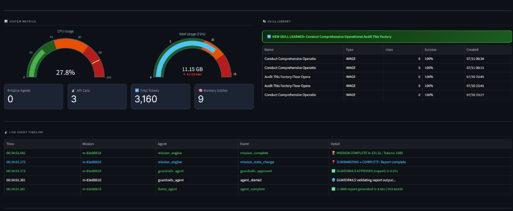
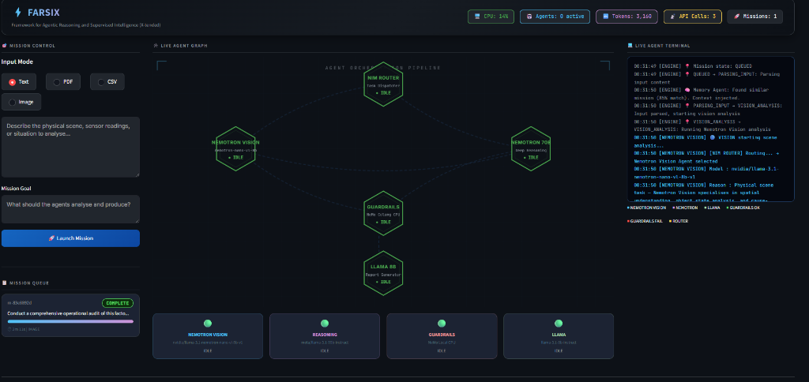

<div align="center">
  <h1>FARSIX: Deterministic Multi-Agent Orchestrator & Cognitive Guardrails Engine</h1>
  <p><b>Advanced Agentic Reasoning and Supervised Intelligence Framework</b></p>
  
  <p>
    <a href="#"></a>
    <a href="#"></a>
    <a href="#"></a>
    <a href="#"></a>
  </p>

  <!-- Autoplaying Demo Video -->
  https://github.com/imFARSI/FARSIX-Deterministic-Multi-Agent-Orchestrator/raw/master/docs/assets/demo.mp4
</div>

---

## 📌 Executive Summary & The Generative AI Bottleneck

In the modern era of Generative AI, building simple API wrappers around Large Language Models (LLMs) is sufficient for chatbots, but **unreliable for mission-critical enterprise workflows**. 

LLMs suffer fundamentally from non-deterministic logic and hallucinations. If a multi-agent system hallucinates data in a critical analytical report or outputs malformed structural parameters, the downstream APIs will fail unpredictably. 

The industry demands a system that bridges the gap between the cognitive reasoning power of modern high-parameter LLMs and the absolute strictness of traditional deterministic software engineering.

---

## 🚀 The Solution: FARSIX Architecture

**FARSIX** (Framework for Agentic Reasoning and Supervised Intelligence) is a production-grade orchestration pipeline designed specifically to solve the non-deterministic nature of multi-agent AI systems. 

It implements a **Dual-Layer Cognitive Architecture**:

### 1. The Reasoning Layer (NVIDIA NIM)
FARSIX delegates heavy cognitive processing to specialized NVIDIA models:
- **Visual Analysis**: Handled by `Nemotron-Nano-VL-8B` to ingest complex diagrams, UI screenshots, and visual data feeds.
- **Logical Deductions**: Handled by `Llama-3.1-70B-Instruct` to formulate operational reports and complex analytics based on the visual findings.

### 2. The Deterministic Guardrails Layer (NVIDIA NeMo)
A zero-latency, programmatic safety net that intercepts all AI outputs *before* they can be executed by downstream enterprise systems or databases.

<div align="center">
  
  <br>
  <i>The real-time SVG Orchestration Dashboard tracking the multi-agent pipeline states.</i>
</div>

---

## 🧠 Core Breakthrough: The Zero-Latency Input Rail

Traditional guardrails rely on a secondary LLM to read and validate the primary agent's output. This approach adds significant latency (1-2 seconds), costs API tokens, and introduces a secondary vector for hallucinations.

FARSIX integrates **NVIDIA NeMo Guardrails** via a highly optimized, custom Colang (`.co`) architecture.

By structuring the Colang rules mathematically as an automatic **Input Rail**, FARSIX triggers 100% deterministic Python Regex validations at the exact millisecond the reasoning model generates text. 
- **Validation Latency**: ~0.07 seconds
- **LLM Tokens Consumed by Guardrails**: 0
- **Safety Guarantee**: Absolute. The system physically blocks the pipeline and forces an automatic retry checkpoint if predefined safety boundaries are violated.

---

## 🏗️ System Components & Directory Structure

FARSIX operates as a robust Directed Acyclic Graph (DAG) state machine.

```text
farsix/
├── app.py                     # Entry point for the real-time SVG Dashboard
├── backend/
│   ├── nim_router.py          # The central topological dispatcher 
│   ├── mission_engine.py      # Resilient state machine and recovery system
│   ├── skill_library.py       # ChromaDB vector RAG for mission context
│   └── agents/                # Microservices (Vision, Llama, Guardrails)
├── guardrails/
│   ├── safety_rules.co        # NeMo Input Rail definitions
│   └── actions.py             # Deterministic Python Regex validations
├── memory/                    # ChromaDB persistent storage implementations
└── tests/                     # Unit and integration test suites
```

### Key Subsystems
1. **Dynamic State Machine (`mission_engine.py`)**: A highly resilient execution engine. If a downstream agent fails (e.g., API timeout or Guardrail block), FARSIX intelligently checkpoints the data and resumes from the exact point of failure, rather than restarting the entire mission from scratch.
2. **Skill Memory (`chroma_store.py`)**: A localized vector database that allows the orchestrator to dynamically retrieve contextual knowledge and past successful procedures based on the current mission profile.
3. **Event Bus (`event_bus.py`)**: Fully asynchronous Pub/Sub architecture for non-blocking agent communication.

<div align="center">
  
  <br>
  <i>System telemetry, active token tracking, and real-time execution logs.</i>
</div>

---

## 🧑‍💻 Developer Guide: Writing Custom Guardrails

FARSIX allows you to write strict programmatic rules that dictate exactly what the AI is allowed to output. This is done via **Colang 1.0** in `guardrails/safety_rules.co`.

Because this is configured as an **Input Rail**, it runs instantly on every message.

```colang
# guardrails/safety_rules.co
define flow check all rules
  $output = $user_message
  
  # Step 1: Execute Python-backed validation action
  $is_safe = execute check_content_safety(text=$output)
  
  # Step 2: Block if violation is found
  if not $is_safe
    bot refuse to respond
    return
    
  # Step 3: Pass if all rules succeed
  bot output safe
```

These Colang actions map directly to custom Python methods in `guardrails/actions.py`, allowing you to use advanced Regex or external APIs to validate the physical constraints of the AI's output.

---

## 🧑‍💻 Developer Guide: Programmatic Execution

If you wish to bypass the UI Dashboard and use FARSIX purely as a headless backend API, you can dispatch missions programmatically via the `nim_router`:

```python
import asyncio
from backend.nim_router import NIMRouter

async def execute_headless_mission():
    router = NIMRouter()
    
    # The dispatcher handles Vision -> Reasoning -> Guardrails
    result = await router.dispatch_mission(
        mission_type="visual_qa",
        payload={
            "image_path": "factory_diagram.png",
            "instruction": "Verify if the robot arm path intersects the human walkway."
        }
    )
    
    if result["status"] == "SUCCESS":
        print("Guardrails Passed:", result["final_report"])
    else:
        print("Mission Blocked or Failed:", result["error"])

asyncio.run(execute_headless_mission())
```

---

## 💼 Primary Use Cases

FARSIX is engineered for high-stakes, mission-critical environments:
- **Automated Workflow Auditing**: Analyzing visual feeds or documents to detect operational anomalies.
- **Enterprise QA Systems**: Verifying that an AI's planned output tokens do not violate system constraints before execution.
- **Complex Root-Cause Diagnosis**: Ingesting complex telemetry (CSV/Text) and providing verified, hallucination-free diagnostic reports to engineers.

---

## ⚙️ Installation & Quick Start

FARSIX is designed to run locally, connecting securely to the NVIDIA NIM cloud API.

### 1. Prerequisites
- **Python 3.11+** (Strict requirement for Streamlit and async compatibility)
- An active **NVIDIA NIM API Key**

### 2. Setup
Clone the repository and install the required dependencies:
```bash
git clone https://github.com/imFARSI/FARSIX-Deterministic-Multi-Agent-Orchestrator.git
cd FARSIX-Deterministic-Multi-Agent-Orchestrator

pip install -r requirements.txt
```

### 3. Environment Configuration
FARSIX relies on `.env` variables to secure credentials. Create a `.env` file in the root directory:
```env
# Your NVIDIA NIM API Key (required for Llama and Nemotron models)
NVIDIA_API_KEY=nvapi-your-key-here
```
*(Note: Because NeMo Guardrails requires an OpenAI key mapping for its compatibility layer, the internal `guardrails_agent.py` automatically binds `OPENAI_API_KEY` to your NVIDIA key. No secondary key is required).*

### 4. Run the Orchestration Dashboard
To launch the real-time SVG dashboard and mission control interface:
```bash
python -m streamlit run app.py
```
*(Windows users can also simply double-click the included `run.bat` script).*

### 5. Running Tests
FARSIX includes a native NeMo integration test suite to verify the deterministic guardrails without needing to launch the full UI.
```bash
python tests/test_guardrails.py
```

---
*Built for the next generation of Enterprise AI systems.*
